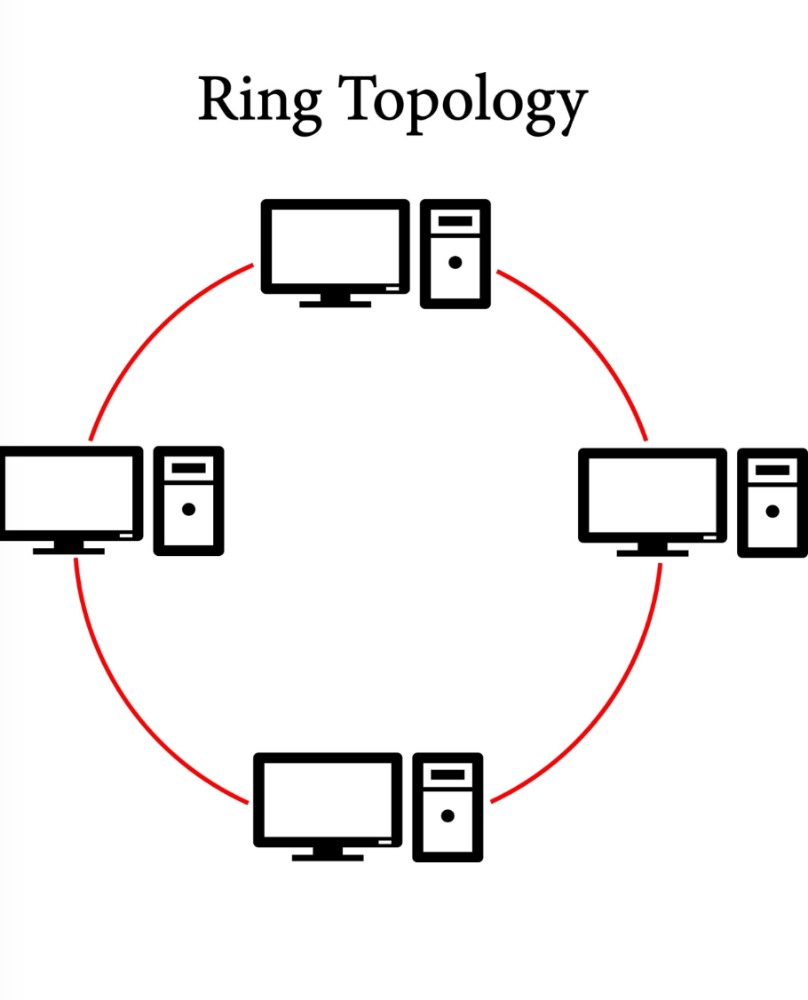
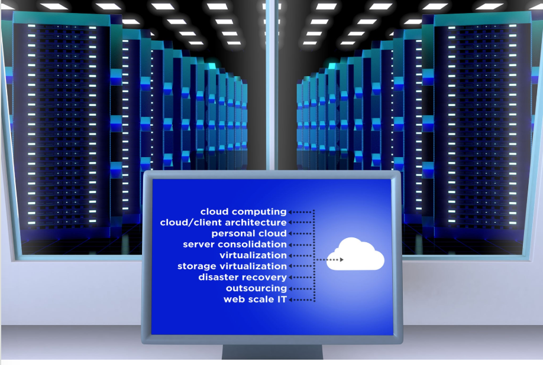

Question prompt: Help me write some efficient and summary questions (and their answers directly below) of this theory notes I took
(in eng btw) and the answers to those questions. Mke them so that the Question (ex.Q1) and directly below the answer to that question (ex. A1)
, include only the important and fundamental stuff, create them according to the perspective of my README goals

- can you give me just cleaned notes if the theory? and if difficult/new concepts/words comes up explaing them

1. Introduction to IT Operations
* Definition: IT Operations (IT Drift) is distinct from System Development.
    * Development: Focuses on building new functionality, systems, and software.
    * Operations: Focuses on ensuring those systems function correctly every day.


* The Goal: IT should "just work." The objective is zero interruptions, no lost information, and no lost work time.
* What is a System? A system consists of algorithms processed on hardware that store results in databases or files.
* Scope: Operations can happen on your own hardware or in the cloud, for internal or external customers, and at any time of day (24/7).
* Stakes: Downtime can be extremely expensive (e.g., costing 1000€ per minute).


2. Infrastructure & Hardware
The physical and virtual foundation that allows IT to function.
* Components: Infrastructure includes servers, networks, storage, data centers, and cloud services.
* Physical Environment: To ensure stability, data centers require:
    * Redundancy (Backups for hardware/power).
    * Power Supply management.
    * Physical Security (Access control).
    * Monitoring of the physical environment (temperature, etc.).



A. Servers

Getty Images
* Definition: A server is essentially a computer designed for specific functions (e.g., a web server).
* Availability: Servers are designed for near 100% uptime (availability).
* Form Factor: They use various hardware and can be virtual (managed by another physical server).


B. Networks

Shutterstock
* Function: Networks connect computers, which ultimately connects users.
* Types: Can be local (LAN) or global (WAN), and wired or wireless.
* Requirements: Networks need protection mechanisms and redundancy to prevent failure.


3. Key Operational Processes

A. Security & Permissions
* Identity: Users (humans) must be identified and verified.
* Structure: Users are often organized into groups.
* Access: Permissions to resources are granted to users or groups, and these rights can change over time.



B. Backups
* Definition: A copy of information that can be created, saved, and deleted.
* Purpose: To restore a system or information to a previous state after an error or loss.
* The 3 Key Questions:
    1. How often is backup taken?
    2. How long is it saved?
    3. How fast can we restore from it? 


C. Troubleshooting
* Reality: Errors occur constantly due to various causes.
* Strategy: You need a strategy to identify what is "normal" vs. "abnormal" behavior.
* Automation: Modern operations aim to identify and even correct errors automatically.



4. Key Concepts & Vocabulary Explained
These terms appeared in your notes. Here is a clearer explanation of what they mean in this context:
* Redundancy:
    * Context: Mentioned in Infrastructure and Networks.
    * Meaning: Having backup components that automatically take over if the primary one fails. For example, a server having two power supplies plugged into different outlets. If one fails, the other keeps the server running.

* Virtual Server (Virtualization):
    * Context: "Hardware... which in turn can be virtual".
    * Meaning: Instead of one physical computer running one server, software allows one powerful physical computer to run many "virtual" computers at once. It saves money and space.

* Algorithms:
    * Context: "Systems... explained as algorithms".
    * Meaning: A set of rules or instructions a computer follows to solve a problem. It's the "logic" inside the software.

* Uptime / Availability:
    * Context: "Planerad upptid... nära 100%".
    * Meaning: The percentage of time a system is fully operational. "100% uptime" means the system never crashes or shuts down.

* Latency vs. Bandwidth (Implied in "Network"):
    * While not explicitly defined in the text, understanding networks usually requires knowing that Bandwidth is how much data can move, and Latency is how fast it gets there.

--------- QUESTIONS ---------
Core Concepts of IT Operations

Q1: What is the primary definition and goal of IT Operations (IT Drift)?
A1: IT Operations ensures that systems function correctly every single day. While system development builds new functionality, IT Operations focuses on keeping systems running without interruptions, data loss, or lost work time—effectively making sure IT "just works".

Q2: How are IT systems fundamentally defined in this context?
A2: Systems are defined as algorithms that process on hardware and store results in databases or files. This hardware requires configuration, monitoring during operation, and lifecycle management.

Q3: What are the main examples of IT Operations responsibilities?
A3: Key responsibilities include managing servers, networks, security (permissions), backups (including restoration), troubleshooting, and providing user support.

Infrastructure & Hardware

Q4: What constitutes IT infrastructure?
A4: Infrastructure consists of servers, networks, storage, data centers, and cloud services. It also includes physical environmental controls like redundancy, power supply, physical access security, and environmental monitoring.

Q5: What is a server and what are its key characteristics?
A5: A server is a computer designed to perform specific functions (e.g., a web server). Its critical characteristics are high availability (aiming for near 100% uptime) and the ability to use various hardware types, including virtual hardware managed by other servers.

Q6: How are networks defined and categorized?
A6: A network connects computers, thereby connecting users. They can be local or global, wired or wireless, and may include various security mechanisms and redundancy measures.

Operational Processes & Security

Q7: How are Security and Permissions managed?
A7: Security involves identifying and verifying human users. Users can be organized into groups, and permissions to specific resources are granted to these users or groups. Importantly, user rights are dynamic and can change over time.

Q8: What are the critical factors in Backup management?
A8: A backup (safety copy) allows for the restoration of systems or information to a previous state. The fundamental strategic questions are: How often is backup taken? How long is it saved? How quickly can restoration be performed?.

Q9: What is the strategy behind Troubleshooting in IT Operations?
A9: Troubleshooting is the process of finding errors to fix them, as errors inevitably occur. Effective troubleshooting requires a strategy to distinguish between normal and abnormal system behavior and determining if errors can be identified or even corrected automatically.

Q10: What are the varying contexts in which IT Operations can occur?
A10: Operations can happen on owned hardware or in the cloud, for internal or external customers, at any time of day, and involving users globally. It is a critical function where downtime can have significant financial costs (e.g., 1000€ per minute).